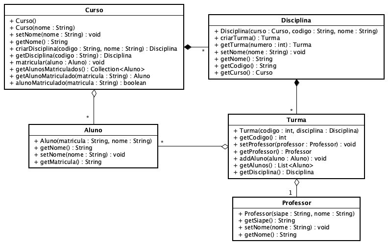

**Universidade Federal da Paraíba - UFPB** \
**Centro de Ciências Exatas e Educação - CCAE** \
**Departamento de Ciências Exatas - DCX**

**Professor:** [Rodrigo Rebouças de Almeida](http://rodrigor.dcx.ufpb.br)

# Avaliação 3 - Reposição


Antes de começar a prova, informe o seu nome completo e faça um COMMIT e 
PUSH antes de começar a prova.

> Nome completo: (seu nome completo aqui)

## Instruções para a prova.

Vai fazer reposição? ( ) Sim ( ) Não

Se vai fazer reposição, você deve responder a questão 1 (REPOSIÇÃO) e pelo 
menos uma questão de PADRÃO e uma de ARQUITETURA.

Se não vai fazer reposição, responda quaisquer questões, desde que somem 10 
pontos.

MARQUE um X na frente das questões que queira que eu corrija.

* [ ] Reposição 1.ª prova (obrigatório responder a QUESTAO REPOSIÇÃO)

**Faça COMMIT e PUSH deste arquivo README.md com a sua resposta.**


### (5 pontos para reposição) QUESTÃO REPOSIÇÃO: Implemente a classe `Fornecedor` e refatore as classes `Loja` e `Produto`, de acordo com o cenário abaixo.

**(CENARIO - Controle de estoque)**

Você precisa implementar um sistema de controle de estoques que gerencia a
venda de produtos. Um produto possui nome, código, preço e estoque. A loja
possui diversos fornecedores e cada fornecedor possui nome, cnpj e telefone. Um
produto pode ser fornecido por diversos fornecedores e um fornecedor fornece
diversos produtos. Cada produto tem um estoque controlado pela loja. A loja
efetua uma venda de um ou mais produtos em uma venda. A venda é realizada em
uma data específica. Cada venda possui um ou mais produtos vendidos. Quando
a venda é executada, o estoque do produto é atualizado. Se o estoque do
produto estiver zerado, a venda não pode ser realizada.

Implemente a classe `Fornecedor` no pacote `br.ufpb.dcx.aps.prova3.vendas`.
- (1pt) Deve ser possível adicionar um ou mais fornecedores em uma loja.
- (1pt) Deve ser possível definir o fornecedor de um produto.
- (1pt) Deve ser possível obter o fornecedor de um produto.
- (1pt) Deve ser possível obter os produtos de um fornecedor.
- (1pt) Deve ser possível obter os fornecedores de um produto.

Dica: Você pode usar a classe LojaTest como referência para implementar a 
classe Fornecedor.

### [ ] (2 pontos) QUESTÃO PADRÃO - FACADE: Implemente uma fachada para sistema especificado no diagrama abaixo.
(Não precisa implementar as classes do diagrama, apenas a classe da fachada 
com os métodos que você sugere.)

Em cada método que você implementar, você deve colocar um comentário 
indicando as classes e métodos envolvidos na operação. Exemplo:

```java
// (mude o nome da sua fachada)
public class Fachada {

    public void metodo1() {
        // Classe1.metodo1()
        // Classe2.metodo2()
    }

    public void metodo2() {
        // Classe1.metodo1()
        // Classe3.metodo3()
    }

    public void metodo3() {
        // Classe2.metodo2()
        // Classe3.metodo3()
    }

}

```



###  [ ] (2 pontos) QUESTÃO PADRÃO - STRATEGY: Implemente apenas a interface do strategy para que a classe `Produto` do pacote `br.ufpb.dcx.aps.prova3` possa ter diversas estratégias de cálculo de preço. Refatore a classe `Produto` para que ela use a interface do strategy que você criou.
A interface criada deve estar no pacote `br.ufpb.dcx.aps.prova3.strategy`.

###  [ ] (2 pontos) QUESTÃO PADRÃO - OBSERVER: Implemente o padrão Observer para que a classe `Produto` do pacote `br.ufpb.dcx.aps.prova3` possa notificar os interessados quando o estoque do produto for atualizado. Refatore a classe `Produto` para que ela use o padrão Observer que você criou.
Basta implementar a interface `Observer` no pacote `br.ufpb.dcx.aps.prova3.
observer`. Não precisa implementar as classes interessadas na notificação.

###  [ ] (3 pontos) QUESTÃO ARQUITETURA 1: Arquitetura de Software: Explique e dê um exemplo para cada um dos requisitos não-funcionais abaixo:
* **Disponibilidade:** (Responda aqui)

* **Segurança:** (Responda aqui)

* **Usabilidade:** (Responda aqui)

* **Escalabilidade:** (Responda aqui)

* **Tolerância a falhas:** (Responda aqui)

###  [ ] (3 pontos) QUESTÃO ARQUITETURA 2: Para que servem os seguintes elementos arquiteturais?

* ** Cache:** (Responda aqui)

* ** Balanceador de carga:** (Responda aqui)

* ** Fila:** (Responda aqui)

###  [ ] (2 pontos) QUESTÃO ARQUITETURA 3: Cite uma vantagem e uma desvantagem de uma arquitetura orientada a microserviços.

* **Vantagem:** (Responda aqui)

* **Desvantagem:** (Responda aqui)